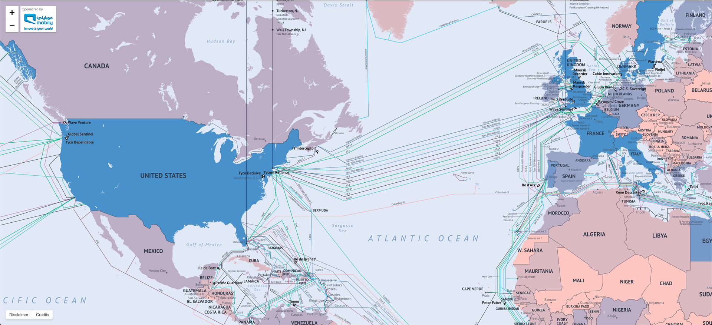
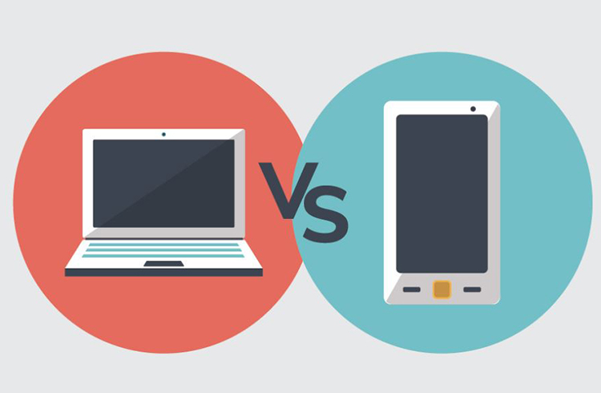

class: middle

<h1>Création  de site web</h1>

### Cours 1

#### HTML & CSS

#### &copy; Mikaël Ruffieux, 09.2021

---

## Qui est en face de vous ?

<table class="unstyled-table">
  <tr>
    <td style="width: 50%;">
      <h3>Mikaël Ruffieux</h3>
      J'ai 25 ans  
      J'habite à <b>Epagny</b> et à <b>Neuchâtel</b>  
      <b>Ingénieur</b> des Médias à la HEIG-VD  
      Mes hobbies : le <b>vélo</b> et la <b>vidéo</b>  
      Mon jeu vidéo préféré : <b>Minecraft</b>
    </td>
    <td style="width: 50%;">
      
      
      
    </td>
  </tr>
</table>

---
class: middle

## Déroulement du cours

- Le cours commence à **17h00**, et se termine à **18h30** ;

- La visioconférence sera lancée quelques minutes avant ;

- Nous ferons une pause de **10 minutes** vers 17h45 ;

### Pendant le cours

- N'hésitez pas à m'interrompre **si vous avez des questions**, vous n'avez pas besoin d'attendre que je vous les pose !

- Vous pouvez aussi poser **vos questions par écrit** dans le tchat, si vous ne voulez pas activer votre micro.

- Vous n'êtes pas obligé.e.s de **garder votre caméra allumée** ; je vous demanderais juste de l'allumer **au début du cours**, le temps de vous dire bonjour :)

---
class: middle

## Qui êtes-vous ?

- Présentez-vous à la classe (votre nom, âge, où vous habitez, où vous allez à l'école, vos passions, etc.)

### Je sais faire ...

- Je sais me connecter sur mon ordinateur / l'ordinateur de mes parents ;
- Je peux taper très vite au clavier ;
- J'utilise le clic droit de ma souris ;
- Je sais faire une recherche Google ;
- J'ai déjà utilisé des programmes comme Word pour écrire des documents ;
- Je connais les languages HTML et CSS ;
- J'ai déjà utilisé un language de programmation (lequel ?).

---

class: middle

# Internet, qu'est-ce que c'est ?

---

## Y'a pas de réseau ici ?

- C'est quoi du "réseau internet" ?

---

## Y'a pas de réseau ici ?

- C'est quoi du "réseau internet" ?

Un réseau, c'est une série de câbles qui relient plusieurs ordinateurs entre eux.

Pour Internet, ces câbles sont immenses, passent sous terre et sous l'eau, et **relient les continents entre eux** !

Grâce à ces câbles, à ces réseaux, on peut accéder à des **informations** qui ne sont pas sur notre ordinateur, mais qui sont enregistrées **sur un autre ordinateur**, un site internet par exemple.

---

## Internet, c'est mondial

https://submarine-cable-map-2014.telegeography.com/

---

## Vous connaissez ?

<table>
    <tr>
        <td style="width: 33%">
            
        </td>
        <td style="width: 33%; text-align: center">
            
        </td>
        <td style="width: 33%">
            
        </td>
    </tr>
</table>

---

## Naissance du web

<table>
    <tr>
        <td style="width: 50%">
            <ul>
                <li>Le web naît en 1989 à Genève, au CERN.</li> 
                <li>On l'appelle aussi le World Wide Web <i>(= réseau d'échelle mondiale)</i>, ou WWW.</li> 
                <li>À l'origine, c'était l'<b>armée américaine</b> qui utilisait ce genre de réseaux, pour communiquer d'une base à l'autre.</li> 
                <li>Puis, c'est plusieurs universités américaines qui se sont reliées entre elles.</li>
            </ul>
        </td>
        <td style="width: 50%; text-align: center">
             
            <small><i>Le réseau Arpanet, en 1969.</i></small>
        </td>
    </tr>
</table>

---
class:middle

## Au final, à quoi ça sert, internet ?

- À quoi ça sert ?

- Qu'est-ce que vous faites sur Internet ?

- Quels sites visitez-vous le plus souvent ?

---
class:middle

## Internet ou World Wide Web ?

Connaissez-vous la différence ?

---
class:middle

## Internet ou World Wide Web ?

**Internet** = plusieurs ordinateurs connectés entre eux, et connectés à "l'extérieur" *(=/= intranet)*

**web** = système de documents **hypertextes**, reliés par des **hyperliens**.

---
class:middle

### De quoi avons-nous besoin pour surfer sur le web ?

---
class:middle

### De quoi avons-nous besoin pour surfer sur le web ?

1. Un appareil capable de se connecter *(ordinateur, smartphone, tablette, mais aussi une voiture, un frigo, etc.)*

2. Une connexion Internet

3. Un **navigateur**

???
Citer des navigateurs

---
class: middle,center

## Les navigateurs

---
class: middle,center

## Qu'est-ce que vous utilisez pournaviguer ?

---
class: middle

### Premières problématiques pour les créateurs / créatrices de site web ...

- Pleins d'appareils avec des écrans différents, avec des manières d'intéragir différentes ... *(clic de souris, trackpad, tactile, etc.)*

- Pleins de navigateurs qui ne fonctionnent pas tous de la même manière ...

---

## Fonctionnement d'un site internet

### Client & Serveur

---

## Fonctionnement d'un site internet

### Client & Serveur

<table>
    <tr>
        <td style="width: 50%">
            <ul>
                <li>Serveur = ordinateur avec un grand disque dur</li> 
                <li>Fonctionnent 24h/7j</li> 
            </ul>
        </td>
        <td style="width: 50%; text-align: center">
            
        </td>
    </tr>
</table>

---
class:middle,center

## Petite pause

#### Je parle moins après, promis

???

Suite sur repl.it :

- création de compte
- premier projet HTML

---

## Sous le capot d'un site web

---
class: center,middle

## Créons notre premier projet

#### Rendez-vous sur [replit.com](https://replit.com/)