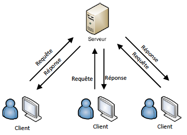

class: middle

<h1>Création <br/>de <span class="secondary-color">site web<span></h1>

### Cours 2

#### HTML & CSS

#### &copy; Mikaël Ruffieux, 09.2021


---
class: center, middle

## Partie <span class="secondary-color">administrative</span>


Pour des communications en dehors du temps de cours, nous communiquerons par **Whatsapp**.

Vous pouvez rejoindre le groupe via ce lien : https://chat.whatsapp.com/FN5Ukj9aAIH50Xx7tSkU8A

---
class: middle

## La semaine <span class="secondary-color">dernière</span>

- **Internet**, c'est quoi ?

- Comment ça fonctionne, un **site web** ? *(si je vous parle de client, de serveur ...)*

- C'est quoi une **balise** ?

---

## Fonctionnement d'un <span class="secondary-color">site internet</span>

### Client & Serveur

<table>
    <tr>
        <td style="width: 50%">
            <ul>
                <li>Serveur = ordinateur avec un grand disque dur</li><br>
                <li>Fonctionnent 24h/7j</li><br>
            </ul>
        </td>
        <td style="width: 50%; text-align: center">
            
        </td>
    </tr>
</table>

---

## Sous le capot d'un <span class="secondary-color">site web</span>


---

## <span class="secondary-color">HTML</span>

*HyperText Markup Language* = Langage hypertexte de balisage

Le HTML définit la **structure** d'un document. Quels sont les éléments importants ? Dans quel ordre est-ce qu'on doit lire la page ?

Sur cette page, quels sont pour vous les éléments **les plus importants**, et lesquels sont **les moins importants** : https://fr.wikipedia.org/wiki/Nino_Schurter

---

## <span class="secondary-color">Exercice</span> : je me présente

```html
<!DOCTYPE html>
<html>
    <head>
        <title>Mon premier fichier HTML</title>
    </head>

    <body>
        <h1>Je me présente</h1>
        <p>Je m'appelle Mikaël, j'ai 25 ans.</p>

        <h2>Études</h2>
        <p>J'ai étudié au collège du Sud, à Bulle, 
            puis à la HEIG-VD, à Yverdon-les-Bains.</p>

        <h2>Passions</h2>
        <p>J'aime la vidéo et le vélo.</p>
    </body>
</html>   
```

---

## L'<span class="secondary-color">entête</span> d'un fichier HTML

```html
<head>
    <meta charset="utf-8">
    <meta name="viewport" content="width=device-width">
    <title>Exercice CSS</title>
    <link rel="stylesheet" href="style.css">
</head>
<body>
    ...
</body>
```

---

## Pour les plus <span class="secondary-color">avancé.e.s</span> ...

- Listes à puces et listes numérotées `<ul>` / `<ol>`

- Les tableaux `<table>`

*Aidez-vous de l'[aide-mémoire](https://github.com/futurekids-io/6.011-creation-de-site-web-2.0/blob/main/aide-memoire/html), pour voir comment ça fonctionne*

<br><br>
**Ajoutez à votre fiche de présentation :**

- une liste dʼinformations personnelles (taille, âge, couleur des yeux, des cheveux);

- la liste de vos 5 films préférés;

- un tableau avec vos horaires dʼécole.

---
class: middle

## Pour la <span class="secondary-color">prochaine</span> fois

Réfléchissez à une idée de projet personnel, un site web que **vous** développerez durant le cours.

Un exemple : https://minecraft.mikaelruffieux.repl.co