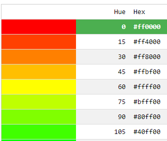

class: middle

<h1>Création <br/>de <span class="secondary-color">site web<span></h1>

### Cours 7

#### HTML & CSS

#### &copy; Mikaël Ruffieux, 03.2021


---

# Petit <span class="secondary-color">rappel</span>

<table class="unstyled-table">
  <tr>
    <td>
      <pre>
        <code>
<span class="red">p</span> {
  <span class="green">font-size</span>: <span class="orange">14px</span>;
  <span class="green">background-color</span>: <span class="orange">red</span>;
}
        </code>
      </pre>
    <td>
    <td>
      = <span class="red">sélecteur</span><br/>
      = <span class="green">propriété (paramètre)</span><br/>
      = <span class="orange">valeur</span>
    </td>
  </tr>
</table>

---

# Petit <span class="secondary-color">rappel</span>

### HTML
```html
<body>
  <h1>Titre</h1>
  <p id=’’test’’>Mon premier paragraphe.</p>
  <p>Mon deuxième paragraphe.</p>
</body>
```

### CSS
```css
body { background : red; }
h1 { background : yellow; }
p { color : blue;
    background : black;
}
#test { color : green; }
```

---

# Les <span class="secondary-color">ID</span> & les <span class="secondary-color">class</span>

### HTML
```html
<div id=’’logo’’>...</div>
<div class=’’titre’’>...</div>
<p>...</p>
```

### CSS
```css
#logo { ... }
.titre { ... }
p { ... }
```

Il est possible d'utiliser **plusieurs fois** la même **classe** dans un document, mais un **ID** doit être **unique**.

---

# Les <span class="secondary-color">couleurs</span>

<table class="unstyled-table">
  <tr>
    <td><h3>Les noms</h3></td><td colspan="2"><h3>Les codes hexadécimaux</h3></td>
  </tr>

  <tr><td>black</td><td>#00000</td><td rowspan="9"></td></tr>
  <tr><td>white</td><td>#ffffff</td></tr>
  <tr><td>grey</td><td>#_ _ _ _ _ _</td></tr>
  <tr><td>blue</td><td></td></tr>
  <tr><td>green</td><td></td></tr>
  <tr><td>yellow</td><td></td></tr>
  <tr><td>purple</td><td></td></tr>
  <tr><td>red</td><td></td></tr>
  <tr><td>...</td><td></td></tr>
</table>


<a href="https://www.w3schools.com/colors/colors_picker.asp" target="_blank">Le sélecteur de couleur de W3Schools</a>

???

Exercice


<!-- ################ Fin de la présentation ################### -->