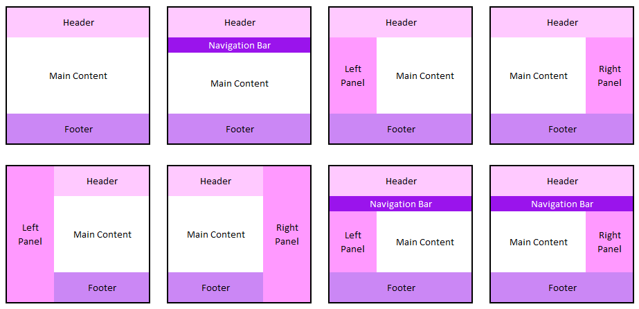
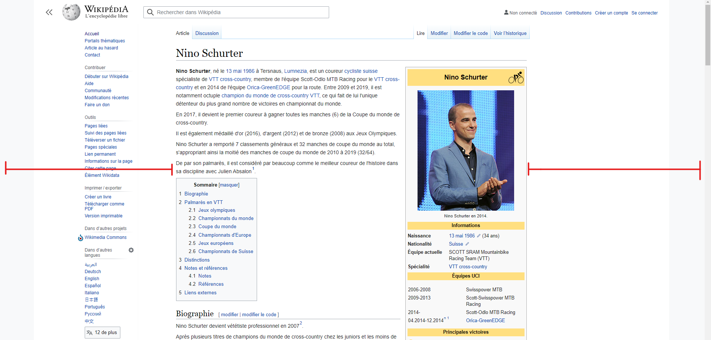

class: middle

<h1>Création <br/>de <span class="secondary-color">site web<span></h1>

### Cours 8

#### HTML & CSS

#### &copy; Mikaël Ruffieux, 03.2021


---

# Les balises <span class="secondary-color">squelette</span>

```html

<body>
    <header>
        <nav>Mon menu</nav>
    </header>
    <main>
        <section>
            Le contenu de mon site
        </section>
    </main>
    <footer>
        Créé par Mikaël Ruffieux
    </footer>
</body>

```

---

# Structurer son <span class="secondary-color">contenu</span>

<a href="https://www.101computing.net/html-website-layout/" target="_blank">
    
</a>

---

# Les bonnes <span class="secondary-color">pratiques</span>

<table>
    <tr>
        <td style="padding-right: 10px; max-width: 900px">
            Afin de faciliter la lecture du visiteur de notre site, on évite d'avoir de trop longues lignes de texte.<br/><br/>
            En principe, on limite à 60 caractères par ligne pour les interfaces "Desktop", et à 30-40 caractères pour une interface mobile.<br/><br/>
            Pour limiter la largeur du contenu principal de notre site, nous allons utiliser un <b>conteneur</b>.
        </td>
        <td>
            
        </td>
    </tr>
</table>

---
class: middle, center

<a href="https://github.com/futurekids-io/6.011-creation-de-site-web-2.0/tree/main/exercices/activite08" target="_blank"><h1>Mise en pratique <i class="fas fa-external-link-alt"></i></h1></a>