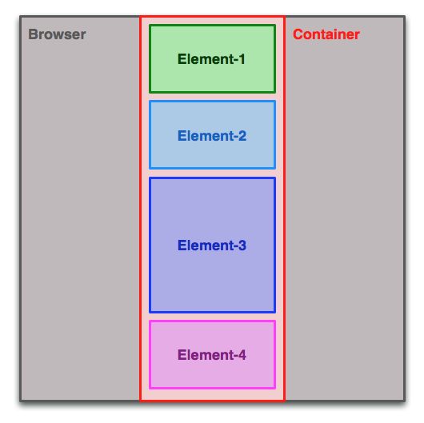
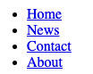
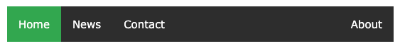

class: middle

<h1>Création <br/>de <span class="secondary-color">site web<span></h1>

### Cours 9

#### HTML & CSS

#### &copy; Mikaël Ruffieux, 03.2021


---

# Petit <span class="secondary-color">rappel</span>

```html
<div class="conteneur"> <!-- en anglais : container -->
  <p>Ceci est mon contenu.</p>
</div>

```
```css
.conteneur {
  max-width: 640px; /* Largeur maximale du conteneur */
  margin: auto; /* Alignement au centre de la page */
}

```

<div style="text-align: center">
  
</div>
<small>Source image : <a href="https://i.stack.imgur.com/tEssz.png" target="_blank">Stack Overflow</a></small>

---

# Styliser vos <span class="secondary-color">"box"</span>

```css
.maBox { 
  padding: 10px; /* 10px de chaque côté */ 
  margin: 10px auto; /* top & bottom - left & right */

  border: 1px solid black; /* épaisseur - type de trait - couleur */
}
.ma2emeBox {
  margin: 20px 10px 5px 0px; /* top - right - bottom - left */
}
```
<div style="text-align: center">
  
</div>

<small>Source image : <a href="https://miro.medium.com/max/725/1*FqGQIGmGdW5EetfS3HFkvA.png" target="_blank">Medium.com</a></small>
---

# Styliser vos <span class="secondary-color">menus</span>

<table>
  <tr>
    <td>Passer de ça</td>
    <td style="padding-left: 50px;">... à ça !</td>
  </tr>
  <tr>
    <td>
      
    </td>
    <td style="padding-left: 50px;">
      
    </td>
  </tr>
</table>

```html
<nav>
  <ul>
    <li><a href="index.html">Accueil</a></li>
    <li><a href="page1.html">Ma page 1</a></li>
    <li><a href="page2.html">Ma page 2</a></li>
    <li><a href="page3.html">Ma page 3</a></li>
    ...
  </ul>
</nav>
```

<small>Sources images : <a href="https://www.w3schools.com/css/css_navbar.asp" target="_blank">W3Schools.com</a></small>

???

Créer un menu en live.

---

# Les <span class="secondary-color">pseudo-classes</span>

Une [pseudo-classe](https://github.com/futurekids-io/6.011-creation-de-site-web-2.0/tree/main/aide-memoire/css#s%C3%A9lecteurs) est un **élément HTML** dans un **état spécial**.

Principalement utilisées pour les liens, il est toutefois possible d'utiliser une pseudo-classe sur **toutes les balises HTML**.

<style>
#lien { color: black; padding: 0px; margin: 0px;}

#lien:hover {color: white;background-color: red;}

#lien:active {background-color: green;}
</style>

<a href="#5" id="lien" ><h3>Mon super lien</h3></a>

```css
a { /* Lien normal */
  color: black;
}

a:hover { /* Au survol de la souris */
  color: white;
  background-color: red;
}

a:active { /* Lien sélectionné */
  background-color: green;
}
```

---
class: center, middle

<a href="https://github.com/futurekids-io/6.011-creation-de-site-web-2.0/tree/main/exercices/activite09" target="_blank"><h1>À vous de jouer <i class="fas fa-external-link-alt"></i></h1></a>

Si c'est trop facile, vous pouvez créer sur votre site des <a href="https://www.w3schools.com/howto/howto_css_subnav.asp">sous-menus</a> !

???

Faire directement l'exercice sur le projet personnel.
Si c'est trop facile, les faire travailler sur des sous-menus.

<!-- ################ Fin de la présentation ################### -->