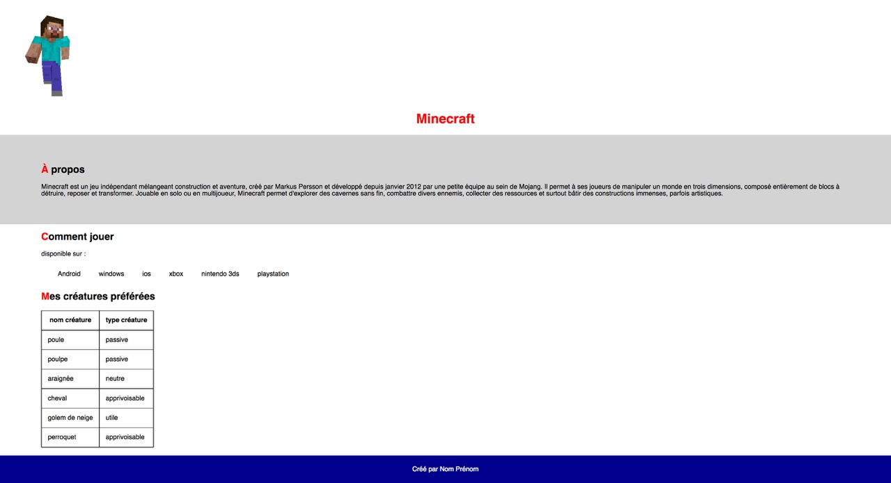

# Activité 8 : Mise en page avec CSS

Voici un exemple de page HTML stylisée avec CSS :

Votre mission, si vous l'acceptez, sera de recréer la mise en page à partir du fichier [index.html fourni](/exercices/activite08/index.html). 

Vous pouvez commencer par créer <b>un nouveau projet [repl.it](https://repl.it)</b>, et copier le contenu [du fichier HTML](/exercices/activite08/index.html) dans votre fichier index.html. 

Vous pouvez maintenant commencer à remplir le fichier <i>style.css</i> de votre projet pour arriver au résultat ci-dessus. Bon travail !

[Corrigé de l'exercice](/exercices/activite08/corrections)
