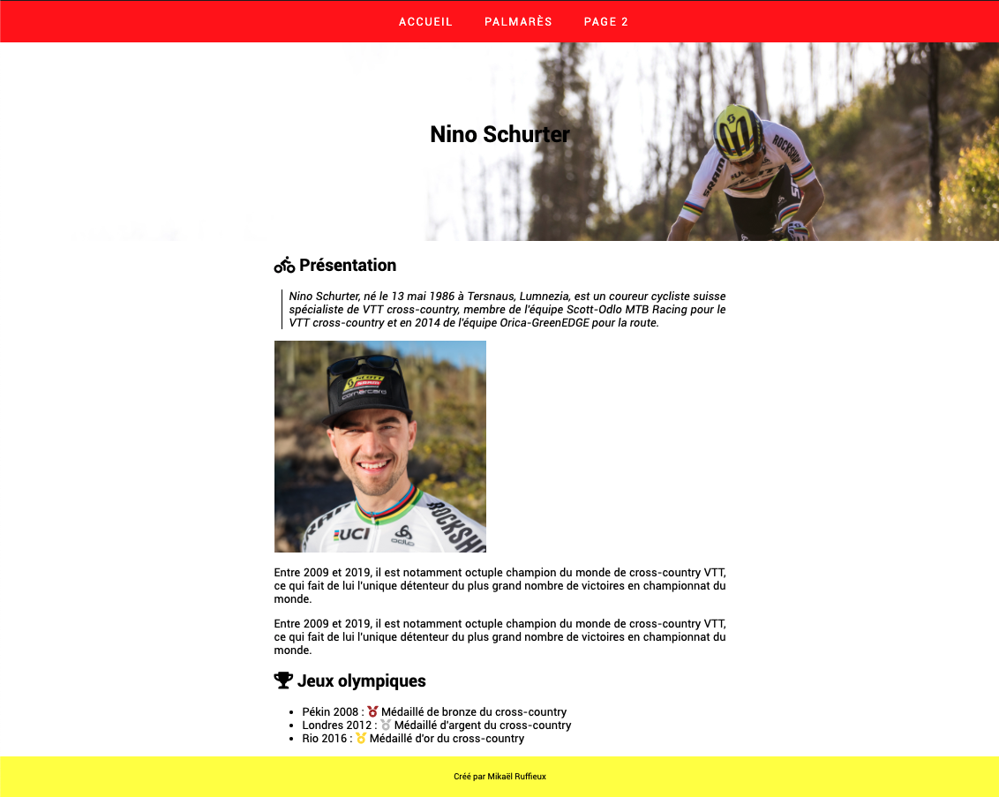
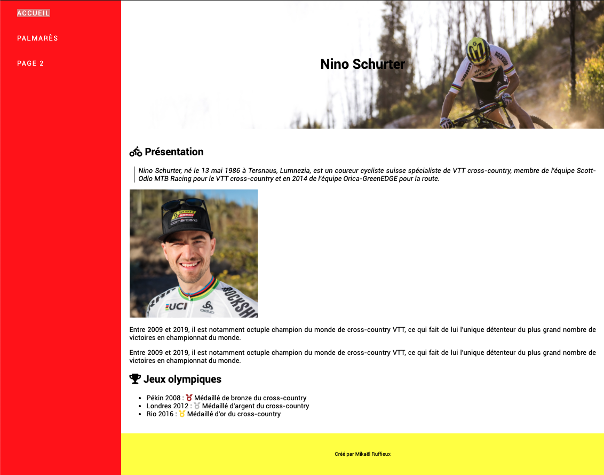

# Activité 9 : Site en 2 pages

Pour cet exercice, nous allons reprendre vos projets personnels, et y implémenter les éléments suivants :

**Page d'accueil (index.html)**
- Un menu
- Une entête "pleine page", avec le nom de votre site, et une image en fond
- Une zone principale, avec du texte
- Un pied de page, indiquant "Créé par Prénom Nom"

**Deuxième page (page2.html)**
- Un menu latéral
- Une entête avec le nom de votre site, et une image en fond
- Une zone principale, avec du texte
- Un pied de page, indiquant "Créé par Prénom Nom"

## Exemples de mise en page :

### Page d'accueil (index.html)

### La page 2 (page2.html)

